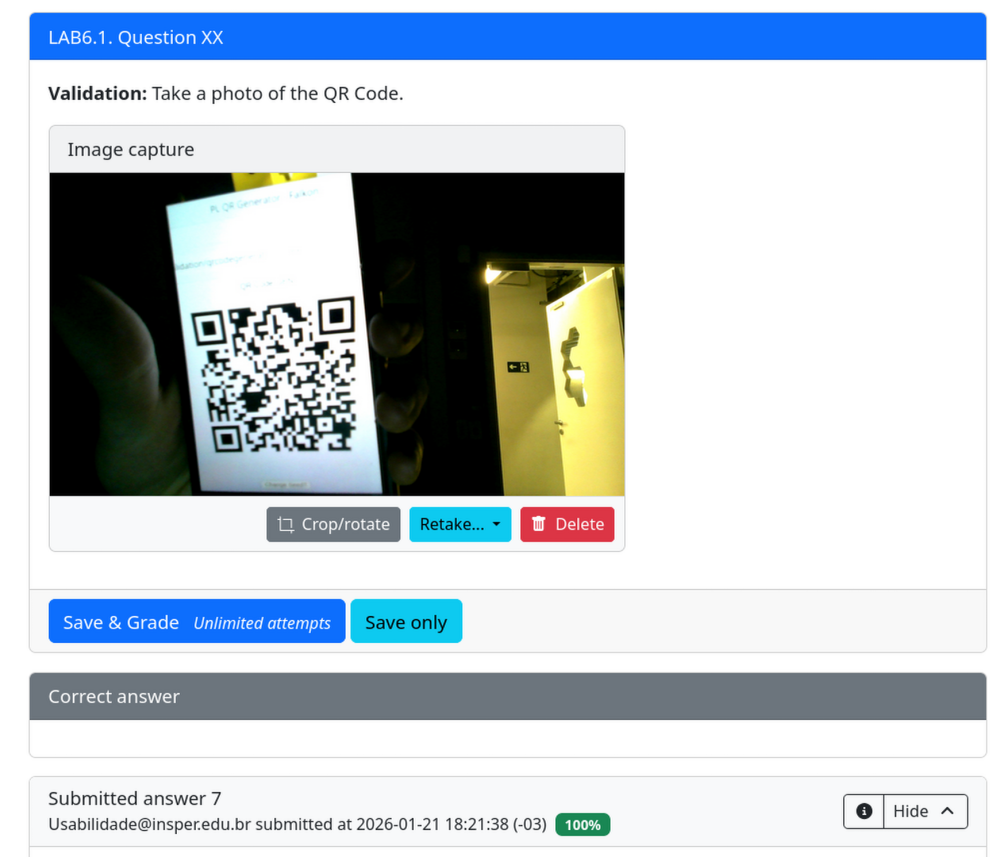

# classroom-qr-checkin

A Python-based automation tool designed to integrate with **PrairieLearn**. This project validates student submissions for labs and generates a cryptographically signed **QR Code** as proof of completion.

* **Secure Validation:** Generates a unique hash upon successful test completion.
* **Visual Proof:** Renders a "Validated" QR Code in instuctors smartphone, that can be scanned by students.

## Student View example

## How to Implement

1.  **Duplicate the Template:**
    Copy the `question-example/` folder and rename it to your new question ID (e.g., `lab01_abc`).

2.  **Update Metadata (`info.json`):**
    * **UUID:** Generate a fresh UUID (crucial to avoid conflicts).
    * **Title:** Update the question title and topic tags.
    * **Image:** Update with you docker image.

3.  **Edit Content (`question.html`):**
    Modify the HTML to display the specific instructions and submission requirements for this new lab.

4.  **Configure Validation (`tests/grade.py`):**
    Update the Python logic to test the specific requirements of the new assignment.

5. **Don`t forget creating the seed.txt with custom a SEED**

5.  **Deploy:**
    Sync the changes to your PrairieLearn server.

## Classroom Workflow

This tool is designed for real-time validation using the lab's camera hardware.

1.  **Instructor: Generate Token**
    The instructor opens the index.html using a smartphone and displays the unique QR code for the current lab session on the screen.

2.  **Action: Scan QR**
    The student points the camera at the instructor's screen to "take a photo" of the QR code.

3.  **Automated Grading**
    Once the QR is recognized, the system automatically triggers the local tests (`tests/grade.py`).
    * **Success:** If matches with the informations generated from index.html (including timestamp and tolerance).
    * **Fail:** QR Code timestamp not matched.

## Docker Build

Build with --platform linux/amd64 for working with PrairieLearn.

1. docker build --platform linux/amd64 -t your_user/your_image:latest .

2. docker push your_username/image:latest 

